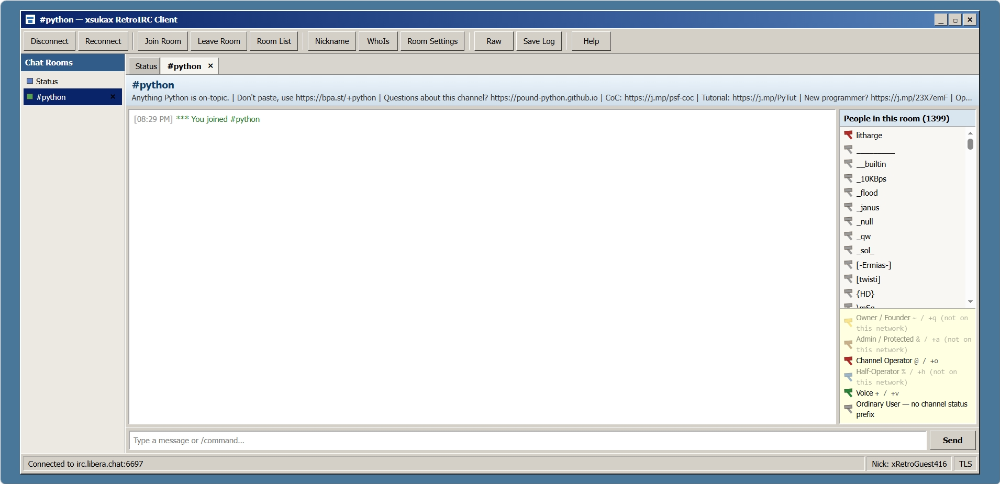

# xsukax RetroIRC Client

[](LICENSE)


**xsukax RetroIRC Client** is a self-hosted, browser-based IRC client powered by Python and `aiohttp`, with a classic MSN-era chat-room interface and mIRC-inspired controls.

Repository: **https://github.com/xsukax/xsukax-RetroIRC-Client**

> The retro MSN-era styling is an interface homage only. This project is not affiliated with Microsoft, mIRC, or any IRC network.

## Overview

xsukax RetroIRC Client provides a lightweight web interface for connecting to traditional IRC networks without requiring a native desktop IRC application. A Python service maintains the IRC TCP/TLS connection while the browser communicates with that local service over a bidirectional WebSocket.

The project is distributed primarily as a self-contained Bash installer. The installer:

- installs the required Debian/Ubuntu packages;
- writes the Python IRC bridge and embedded web interface to `/opt/xsukax-retroirc/app.py`;
- creates `/etc/default/xsukax-retroirc` for runtime configuration;
- creates and enables a hardened `systemd` service when `systemd` is available; and
- starts the web interface on `127.0.0.1:8785` by default.

The client is designed for desktop, tablet, and mobile browsers and includes room tabs, private conversations, IRC room discovery, user privilege visualization, moderation tools, authentication options, reconnect support, and raw IRC command access.

## Screenshot



## Features

### IRC connectivity

- Connect to standard IRC servers over plaintext TCP or TLS/SSL.
- Default support for the conventional IRC ports:
  - `6697` for TLS-enabled IRC networks.
  - `6667` for traditional plaintext IRC networks.
- Custom IRC server, port, nickname, real-name label, and alternative nickname support.
- Automatic fallback to configured alternative nicknames when the preferred nickname is already in use.
- Automatic reconnect after unexpected connection loss.
- Optional automatic rejoin of open rooms following reconnect.
- Manual reconnect and clean disconnect controls.
- Disconnect returns the interface to the Connection Center.

### Included network presets

The interface contains presets for multiple IRC networks while still allowing fully custom server details:

- Libera.Chat
- OFTC
- EFnet
- Undernet
- DALnet
- QuakeNet
- Rizon
- IRCnet
- HybridIRC
- Snoonet
- GameSurge
- EsperNet
- freenode
- GeekShed
- SwiftIRC

Server and port fields remain editable even when a preset is selected.

### Authentication

Registered IRC accounts can use several authentication methods:

- SASL PLAIN
- NickServ `IDENTIFY`
- IRC server `PASS`
- Undernet X login
- QuakeNet Q authentication
- GameSurge AuthServ

The Python bridge also negotiates IRC capabilities where supported, including `multi-prefix`, `userhost-in-names`, `away-notify`, and `account-notify`.

> For any authentication method that transmits credentials, use TLS whenever the IRC network supports it.

### Rooms and private conversations

- Join and leave IRC channels.
- Open private message/query tabs.
- Close room and private-chat tabs individually.
- Display room topics.
- Browse the IRC server's `/LIST` room directory.
- Filter room names and topics.
- Sort the room list by room name, user count, or topic.
- Track room users and membership prefixes.
- Run WHOIS lookups.
- Save the currently displayed chat/status log from the browser.

### IRC privilege visualization

Channel membership roles are represented with hammer icons whose colors are based on the actual IRC membership mode rather than the number or ordering of ranks advertised by a specific network:

| IRC Mode | Typical Meaning | Hammer Color |
|---|---|---|
| `+q` | Owner / Founder | Yellow |
| `+a` | Admin / Protected | Brown |
| `+o` | Channel Operator | Red |
| `+h` | Half-Operator | Blue |
| `+v` | Voice | Green |
| none | Ordinary User | Gray |

Additional server-specific membership modes are displayed with deterministic extra colors.

A privilege is treated as a channel membership level only when the IRC server advertises it through its `005 PREFIX=(modes)prefixes` information. Service users such as ChanServ therefore receive the color corresponding to the actual channel status advertised by the network.

### Moderation and room administration

Where the connected IRC network and your channel privileges permit, the UI provides controls for:

- Kick
- Ban
- Kick + Ban
- View and refresh the ban list
- Give/remove Owner (`+q`)
- Give/remove Admin (`+a`)
- Give/remove Operator (`+o`)
- Give/remove Half-Op (`+h`)
- Give/remove Voice (`+v`)
- Edit room topics
- Configure common room modes such as `+i`, `+m`, `+n`, `+t`, `+s`, and `+p`
- Configure room key (`+k`) and user limit (`+l`)
- Send network-specific advanced `MODE` commands

### Supported slash commands

The client includes convenient handling for common IRC commands:

```text
/join #room [key]
/part [#room] [reason]
/nick NewNick
/msg Nick message
/query Nick
/me action text
/notice Nick message
/whois Nick
/mode #room +m
/topic [new topic]
/kick Nick [reason]
/ban Nick
/unban mask
/invite Nick [#room]
/away [message]
/list [pattern]
/raw IRC COMMAND
/clear
/disconnect [reason]
```

The **Raw** control can also send protocol commands directly to the connected IRC server.

### Responsive retro interface

- Classic MSN-era / Windows-style visual design.
- Responsive layout targeting desktop, tablet, and mobile browsers.
- 96% viewport-based application layout.
- Horizontal toolbar and tab scrolling where required.
- On phones, the room-navigation panel is hidden to maximize chat space.
- The room user list becomes an on-demand **People** drawer on mobile devices.
- Responsive dialogs, forms, moderation controls, and status areas.
- Dedicated status, room, and private-chat buffers.

## Prerequisites

The provided installer is designed for **Debian/Ubuntu and compatible APT-based Linux systems**.

You will need:

- A Debian/Ubuntu-based Linux system.
- `root` access or a user with `sudo` privileges.
- Internet access for `apt` package installation and IRC connectivity.
- A modern web browser with WebSocket support.
- Outbound network access to the IRC servers and ports you intend to use.
- `systemd` is recommended for automatic service management, but the application can also be started manually if `systemd` is unavailable.

The installer automatically installs:

```text
python3
python3-aiohttp
ca-certificates
```

No Node.js, npm, PHP, database server, or frontend build process is required.

## Installation

### 1. Clone the repository

```bash
git clone https://github.com/xsukax/xsukax-RetroIRC-Client.git
cd xsukax-RetroIRC-Client
```

### 2. Make the installer executable

```bash
chmod +x xsukax_retroirc.sh
```

### 3. Run the installer

```bash
sudo ./xsukax_retroirc.sh
```

The installer will:

1. request elevated privileges automatically if necessary;
2. update APT package metadata;
3. install Python 3, `aiohttp`, and CA certificates;
4. create `/opt/xsukax-retroirc/app.py`;
5. validate the generated Python application with `python3 -m py_compile`;
6. create `/etc/default/xsukax-retroirc`;
7. create `/etc/systemd/system/xsukax-retroirc.service`;
8. enable and start the service when `systemd` is available.

### 4. Open the interface

With the default configuration, browse to:

```text
http://127.0.0.1:8785/
```

The application also exposes a health endpoint at:

```text
http://127.0.0.1:8785/healthz
```

### Custom installation settings

Installer-time environment variables can override stored defaults:

```bash
sudo env \
  XSUKAX_BIND=127.0.0.1 \
  XSUKAX_PORT=8785 \
  ALLOW_PRIVATE_IRC=0 \
  ALLOW_CROSS_ORIGIN=0 \
  LOG_LEVEL=INFO \
  ./xsukax_retroirc.sh
```

Re-running the installer upgrades/recreates the generated application while preserving the existing configuration file unless explicit environment-variable overrides are supplied.

## Configuration

Runtime settings are stored in:

```text
/etc/default/xsukax-retroirc
```

Default configuration:

```ini
XSUKAX_BIND=127.0.0.1
XSUKAX_PORT=8785
ALLOW_PRIVATE_IRC=0
ALLOW_CROSS_ORIGIN=0
LOG_LEVEL=INFO
```

### Configuration options

| Variable | Default | Description |
|---|---:|---|
| `XSUKAX_BIND` | `127.0.0.1` | Address used by the local HTTP/WebSocket service. |
| `XSUKAX_PORT` | `8785` | Port used by the web interface. |
| `ALLOW_PRIVATE_IRC` | `0` | When `0`, blocks IRC targets resolving to private, loopback, link-local, or reserved IP addresses. Set to `1` only when intentional LAN/private-network IRC access is required. |
| `ALLOW_CROSS_ORIGIN` | `0` | When `0`, rejects cross-origin WebSocket requests. |
| `LOG_LEVEL` | `INFO` | Python application logging level. |

After changing the configuration, restart the service:

```bash
sudo systemctl restart xsukax-retroirc
```

### Remote browser access

The default `127.0.0.1` bind is intentionally local-only. If you deliberately need to make the web interface reachable from another device, you can change the bind address, for example:

```ini
XSUKAX_BIND=0.0.0.0
```

Then restart the service.

**Do not expose the application directly to an untrusted or public network without additional protection.** If remote access is required, use a properly configured HTTPS reverse proxy, firewall restrictions, and an authentication/access-control layer appropriate for your deployment.

## Usage

### Start the client

1. Open `http://127.0.0.1:8785/`.
2. Select a predefined IRC network or choose a custom server.
3. Enter or confirm:
   - server hostname;
   - server port;
   - nickname;
   - optional alternative nicknames;
   - real-name label;
   - TLS setting.
4. If the IRC account is registered, enable registered-user authentication and choose the appropriate authentication method.
5. Click **Connect to IRC**.
6. Use **Join Room** or `/join #channel` to enter a channel.
7. Use the room tabs to switch between channels and private conversations.
8. Right-click a nickname for private-chat, WHOIS, copy, or moderation actions.
9. Use **Disconnect** when finished; the application will return to the Connection Center.

### Service management

Check service status:

```bash
sudo systemctl status xsukax-retroirc
```

Start the service:

```bash
sudo systemctl start xsukax-retroirc
```

Stop the service:

```bash
sudo systemctl stop xsukax-retroirc
```

Restart after configuration changes:

```bash
sudo systemctl restart xsukax-retroirc
```

Follow service logs:

```bash
sudo journalctl -u xsukax-retroirc -f
```

### Manual startup without systemd

If `systemd` is unavailable, load the environment configuration and start the generated Python application manually:

```bash
set -a
source /etc/default/xsukax-retroirc
set +a
python3 /opt/xsukax-retroirc/app.py
```

### Uninstallation

From the repository directory, run:

```bash
sudo ./xsukax_retroirc.sh --uninstall
```

This removes:

- the `xsukax-retroirc` service;
- `/opt/xsukax-retroirc`;
- `/etc/default/xsukax-retroirc`; and
- the generated `systemd` unit.

## Project Structure

The repository is intentionally compact because the Bash installer contains the embedded Python application, HTML, CSS, and JavaScript interface.

```text
xsukax-RetroIRC-Client/
├── xsukax_retroirc.sh   # Installer and embedded RetroIRC application source
├── README.md            # Project documentation
└── LICENSE              # GNU GPL v3.0 license text
```

After installation, the important system files are:

```text
/opt/xsukax-retroirc/
└── app.py

/etc/default/
└── xsukax-retroirc

/etc/systemd/system/
└── xsukax-retroirc.service
```

### Runtime architecture

```text
Modern Web Browser
       │
       │ HTTP + WebSocket
       ▼
Python / aiohttp service
       │
       │ IRC TCP or TLS
       ▼
     IRC Server
```

The HTTP application exposes:

- `/` — RetroIRC browser interface
- `/healthz` — health/status response
- `/ws` — browser-to-Python WebSocket used for the live IRC session

## Contributing

Contributions, bug fixes, compatibility improvements, and UI refinements are welcome.

### Suggested contribution workflow

1. Fork the repository.
2. Create a focused feature or fix branch:

   ```bash
   git checkout -b fix/short-description
   ```

3. Make your changes.
4. Keep the self-contained installer model intact unless a larger architectural change is intentionally proposed.
5. Preserve compatibility with supported Debian/Ubuntu environments.
6. Avoid introducing unnecessary dependencies.
7. Validate the shell script:

   ```bash
   bash -n xsukax_retroirc.sh
   ```

8. Test installation on a disposable Debian/Ubuntu environment.
9. Verify that the generated Python application starts successfully and that:
   - the Connection Center loads;
   - WebSocket connectivity works;
   - IRC TLS and plaintext connections behave as expected;
   - room joins/parts work;
   - room/user lists remain usable;
   - tabs and disconnect behavior work;
   - mobile responsive behavior remains functional.
10. Commit with a clear, descriptive message.
11. Push your branch and open a Pull Request.

### Code quality expectations

Contributions should:

- follow the existing coding style;
- keep shell commands safe under `set -Eeuo pipefail`;
- validate user-controlled server, port, nickname, and IRC command data;
- avoid logging credentials or sensitive authentication data;
- preserve secure defaults;
- maintain browser compatibility without requiring a frontend build system;
- keep UI behavior functional across desktop, tablet, and mobile layouts; and
- document user-visible changes in the Pull Request.

For substantial changes, opening an issue before implementation is encouraged so the design can be discussed first.

## Security

Security-sensitive changes should preserve the project's conservative defaults.

The current implementation includes several defensive measures:

- the web service binds to `127.0.0.1` by default;
- private, loopback, link-local, and reserved IRC destinations are blocked by default;
- cross-origin WebSocket connections are blocked by default;
- IRC server, port, nickname, and authentication configuration are validated server-side;
- TLS connections use Python's default certificate-verifying SSL context;
- HTTP responses include defensive headers such as `X-Content-Type-Options`, `Referrer-Policy`, and `X-Frame-Options`;
- the `systemd` service uses `DynamicUser`, `NoNewPrivileges`, filesystem protections, capability restrictions, private devices/tmp, and additional sandboxing controls.

### Credential safety

IRC credentials may be transmitted to the selected IRC network according to the chosen authentication method. Prefer IRC-over-TLS whenever passwords or account credentials are used.

Do not:

- publish real IRC passwords in issues, screenshots, logs, or configuration examples;
- enable `ALLOW_PRIVATE_IRC=1` unless private-network IRC targets are intentionally required;
- enable `ALLOW_CROSS_ORIGIN=1` without understanding the browser security implications;
- bind the web application to a public interface without additional access controls.

### Reporting vulnerabilities

Please do **not** publish working exploits, credentials, or detailed vulnerability information in a public issue.

Preferred reporting process:

1. Use GitHub's private vulnerability reporting / **Security** tab for this repository if it is enabled.
2. If private reporting is not available, contact the maintainer through the GitHub profile and provide only enough public information to establish contact.
3. Include the affected version, reproduction conditions, security impact, and suggested mitigation when possible.
4. Allow reasonable time for investigation and remediation before public disclosure.

Repository:

**https://github.com/xsukax/xsukax-RetroIRC-Client**

## License

This project is distributed under the **GNU General Public License v3.0 (GPL-3.0)**.

You may use, study, modify, and redistribute the software under the terms of GPL-3.0. Modified and redistributed versions must comply with the obligations of that license.

See the [`LICENSE`](LICENSE) file for the complete license text.

## Author / Maintainers

**xsukax**  
Primary developer and maintainer

- GitHub: [@xsukax](https://github.com/xsukax)
- Repository: [xsukax/xsukax-RetroIRC-Client](https://github.com/xsukax/xsukax-RetroIRC-Client)

Contributors are welcome through GitHub Issues and Pull Requests.

---

**xsukax RetroIRC Client** — classic IRC interaction with a retro web interface and a lightweight Python backend.
